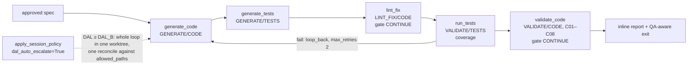

# INT-US-03 — Autonomous Implementation Integration

**Status**: APPROVED — approved by Steve Bula on 2026-07-17 (AD-5, AD-6, AD-7 all resolved "yes").
AD-8 approved by Steve Bula 2026-07-21. **COMPLETE** — SF-01, SF-02, SF-03 committed to `main`
(SF-03: `64d44a71`, 2026-07-21). · **Phase**: 6 · **Feature ID**: INT-US-03

| | |
|---|---|
| Pipes | Implementation Generator (`D-INTL-01`) → QA Runner (`D-VAL-01`) → Code Validation Rules (`D-VAL-05`) |
| Isolation from | US-9 Core worktree isolation (`INT-US-09`) · per-run session isolation `C-EXEC-06`, integrated by `INT-US-09-SF05` |
| Unblocks | US-17 (SWE-Bench), US-19 (Fleet), US-22 (Contracts), US-24 (Scenarios) |
| Not touched | Podman/containers (`D-EXEC-01`, `B-EXEC-01`) — see [Container-free scope](#container-free-scope) |
| Add-ons | `INT-US-03-SF01/SF02` (multi-language QA, UI drift), still Pending Design |

## What it does

Closes the flagship US-3 loop: *hand an approved spec → generate code, generate tests, run the
tests, run C01–C08 code validation, and auto-fix linting errors* — from one command.

`sw implement` used to stop after writing `src/<stem>.py` and `tests/test_<stem>.py` and print "now
run `sw check` manually". QA is now an in-pipeline stage, reported inline. Untrusted generated code
runs worktree-bounded when the touched code's DAL warrants it (AD-8), never against the real source
root. No new capability is added: generator, QA runner, lint-fix loop, validation handlers and
worktree isolation all pre-exist and are dispatched by the flow engine.

### Container-free scope

`D-EXEC-01` is **out**. Per the capability registry and `US-09_integration.md`, Podman/container execution (`D-EXEC-01` Podman/Docker Integration +
`B-EXEC-01` Ephemeral Podman Sub-Containers) is not part of US-9 *Core*; it is the separate,
still-**Pending-Design** US-9 add-on `INT-US-09-SF01` (Containerized Isolation). US-3's declared Core
dependency is **US-9 *Core*** = container-free git-worktree isolation. Podman-exclusive QA for the
implement loop is deferred to a future `INT-US-03` sub-story that depends on `INT-US-09-SF01`. The
`US-03_integration.md` prose that said "Zero-Trust **Podman** Sandbox (`D-EXEC-01`)" was corrected
(AD-6).

## Architecture

The pipeline is the **inline** `implement_spec` `PipelineDefinition` in
`workflows/implementation/interfaces/cli.py`, run by `PipelineRunner`. QA targets are this run's
generated files: `src/<stem>.py` and `tests/test_<stem>.py`, `stem = spec.stem − "_spec"`.

| Piece | Lives in | Role here |
|---|---|---|
| `sw implement` (`D-INTL-01`) | `workflows/implementation/interfaces/cli.py` | builds the pipeline, applies the session policy, reports |
| QA Runner (`D-VAL-01`) | `QARunnerAtom` via `ValidateTestsHandler` | `run_tests`; exports `{passed, failed, errors, skipped, total, duration_seconds, coverage_pct, failures[]}` |
| Lint-Fix Reflection Loop (`D-VAL-01`) | `LintFixHandler`, key `lint_fix+code` | Phase 1 `ruff format` + `ruff check --fix`; Phase 2 LLM reflection up to `max_reflections` (default 3); exports `{reflections_used, lint_errors_remaining, auto_fixed}` |
| Code Validation Rules (`D-VAL-05`) | `ValidateCodeHandler` | C01–C08 (tests-pass, coverage, type hints, architecture) |
| Session isolation (`C-EXEC-06`) | `apply_session_policy` + `execute_run` | one worktree per run, one authorized reconcile |
| DAL | `DALResolver` + `DALLevel` | decides whether isolation auto-enables |

`new_feature.yaml` already chains `generate_code → generate_tests → run_tests (validate/tests,
coverage, loop_back→generate_code, max_retries 2) → validate_code (validate/code, C01–C08) →
review_code` — the template for this wiring, minus the spec draft/validate/review + HITL stages (the
spec is already approved) and minus `lint_fix`.

**Boundary rules**: `workflows/implementation/context.yaml` is an `orchestrator` with `consumes:
[llm, config, validation]`, `forbids: []`. The CLI already imports the flow symbols (`StepAction`,
`StepTarget`, `PipelineDefinition`, `PipelineStep`, `RunContext`, `PipelineRunner`). Adding
`VALIDATE`/`LINT_FIX` steps and reading `settings.sandbox` uses only already-consumed dependencies →
**no new import, no boundary change, no architectural switch.** (`tach check` must stay green.) Two
handler edits outside the module (`ValidateCodeHandler._find_code_path`,
`LintFixHandler._find_code_files`) were approved as SF-01 Q1 / SF-02 Q1.

Code references with line numbers: the [SF-01 plan](INT-US-03_sf01_implementation_plan.md).
Guide: `pipeline_engine_guide.md §7` documents the DAL-escalation policy.

## Decisions

| # | Decision | Rationale | Architectural Switch? |
|---|----------|-----------|----------------------|
| AD-1 | Extend the **existing inline** `implement_spec` pipeline in `cli.py` rather than switching `sw implement` to load `new_feature.yaml`. | `new_feature.yaml` also runs spec draft/validate/review + HITL — wrong for an already-approved spec. Appending QA steps to the inline definition is minimal, in-module, and adds no import. | No |
| AD-2 | QA steps use `use_worktree=None` (defer to policy) + thread `enforce_isolation` into `RunContext` from `settings.sandbox`. | Reuses the shipped `INT-US-09` isolation mechanism verbatim; zero new sandbox code. | No |
| AD-3 | Include `validate_code` (C01–C08 / `D-VAL-05`) in the base loop. | `D-VAL-05` is a **declared US-3 Core dependency**; integrating it is the base contract's job (contrast `D-EXEC-01`, which is a US-9 *sub-story* dep and thus excluded). | No |
| AD-4 | Resolve QA `target` to the generated `src/<stem>.py` / `tests/test_<stem>.py` via the existing stem convention. | Matches how `sw implement` already derives paths (`cli.py:99-104`) and how `validation_hydrator` derives `test_<stem>.py`; no new state-passing machinery needed. | No |
| AD-5 | **[SUPERSEDED by AD-8, 2026-07-21]** `sw implement` forces isolation **on** by default (approved 2026-07-17). | The contract says QA "MUST execute exclusively inside the sandbox," and LLM-generated code is untrusted. Replaced because blanket default-on imposes worktree/reconcile friction (clean-tree requirement, `chore(sandbox)` commit) on *all* implement runs incl. small/interactive projects. | Superseded. |
| AD-8 | **[RESOLVED — approved by Steve Bula 2026-07-21]** `sw implement` isolation policy = **opt-in default + DAL-driven auto-escalation (Option C).** Per-run session isolation stays off by default; the shared `apply_session_policy` **auto-enables it when the touched code's resolved DAL is `DAL_B` or stricter** (`is_strict`). Overridable: `[sandbox] enforce_session_isolation` forces always-on; `[sandbox] auto_isolate_min_dal` sets/disables the threshold. Non-git under escalation degrades to host (never breaks the command). Folded into `INT-US-03 SF-03` as a small enhancement to the shared `apply_session_policy`, **opt-in per caller** (`dal_auto_escalate` param): **`sw implement` opts in; `sw run`/`sw resume` do not** — so escalation fires only where untrusted code is generated, never on benign `sw run` pipelines (e.g. `validate_only`). | Reuses the existing `DALResolver` + `DALLevel` risk machinery: isolation cost (ephemeral worktree, reconcile commit, clean-tree requirement) falls **only** on code whose assurance level justifies it, never on small/low-DAL projects. Zero config for the common case. | No (policy enhancement to the shipped `C-EXEC-06` session policy; no new capability). |
| AD-6 | **[RESOLVED — approved 2026-07-17]** Correct `US-03_integration.md` prose: replace "Zero-Trust Podman Sandbox (`D-EXEC-01`)" with "US-9 Core zero-trust **worktree** sandbox (container-free; Podman = `INT-US-09-SF01`, out of scope)". *(Applied 2026-07-17.)* | The prose dragged a US-9 *sub-story* capability (`D-EXEC-01`) into base contracts, contradicting the declared dependency graph. | No — doc edit. |
| AD-7 | **[SUPERSEDED — 2026-07-21]** SF-03 *consumes* the per-run (session) worktree mode, **`C-EXEC-06`** (SF-01/02/03 committed), integrated by **`INT-US-09-SF05`** (✅): one `apply_session_policy(context, settings, logger)` call in the implement CLI (`PipelineRunner.run()` already routes through `execute_run`), the policy decision, and the FR-8 proof. | In session mode the WHOLE implement loop runs in ONE worktree, so generated files persist in-tree across steps (generate → run_tests → lint_fix → validate) with a **single** end-of-run authorized reconcile against `allowed_paths` — no per-step `strip_merge` carry, no per-step `allowed_paths` threading (`context.allowed_paths`), no spike. Replaced the original per-step plan: `execute_in_sandbox` is **per-step** (fresh worktree from branch HEAD, torn down after, inter-step data only via `strip_merge`), a clean HEAD checkout does **not** carry uncommitted generated files, and the SF-03 spike proved it cannot (`TECH-012`). | **Resolved via the approved per-run architectural switch (`C-EXEC-06`, AD-5).** |

## Functional Requirements

| # | FR | Actor | Action | Outcome |
|---|-----|-------|--------|---------|
| FR-1 | Native test run | `implement` pipeline | SHALL append a `run_tests` step (`VALIDATE`/`TESTS`) after `generate_tests`, executing the generated tests via `QARunnerAtom.run_tests` with `coverage=true`. | Generated tests are run automatically; step exports `{passed, failed, coverage_pct, …}`. |
| FR-2 | Auto-fix linting | `implement` pipeline | SHALL append a `lint_fix` step (`LINT_FIX`/`CODE`) running `ruff` auto-fix then the LLM reflection loop (`max_reflections` default 3) over the generated code. | Lint errors are auto-corrected; step exports `{reflections_used, lint_errors_remaining, auto_fixed}`. |
| FR-3 | Code validation rules | `implement` pipeline | SHALL append a `validate_code` step (`VALIDATE`/`CODE`) running `D-VAL-05` rules C01–C08 over the generated code. | Generated code is validated (tests-pass, coverage, type hints, architecture) — the declared US-3 Core `D-VAL-05` dependency is exercised. |
| FR-4 | Generated-target resolution | `implement` pipeline | SHALL resolve each QA step's `target` to this run's generated files (`src/<stem>.py`, `tests/test_<stem>.py`, `stem = spec.stem − "_spec"`). | QA runs against the freshly generated artifacts, not stale or unrelated paths. |
| FR-5 | Zero-trust QA execution | `implement` `RunContext` | SHALL resolve `enforce_isolation` from `SandboxSettings` and set `use_worktree=None` on all QA/lint steps, so that under the US-9 policy every QA/test/lint process runs **worktree-bounded** (container-free), never against the real source root. | Untrusted generated code is executed exclusively inside the US-9 zero-trust worktree sandbox; the real source root is never mutated by generated tests. |
| FR-6 | Failure loop-back | `implement` pipeline | SHALL gate `run_tests` with `on_fail: loop_back → generate_code`, `max_retries: 2` (mirroring `new_feature.yaml`). | On test failure the loop attempts bounded regeneration before surfacing failure. |
| FR-7 | Inline QA reporting | `implement` command | SHALL report QA + lint outcomes inline (pass/fail, coverage %, reflections used, lint errors remaining) and remove the stale "run `sw check` manually" next-steps message. | The user sees the full autonomous result from one command; no manual follow-up implied. |
| FR-8 | Verifiable proof | test suite | SHALL provide an e2e test driving the full `implement → run_tests → lint_fix → validate_code` loop with `enforce_isolation=True`, proving generated tests run pytest **worktree-bounded** (cwd inside `.worktrees/`, source root unmutated) and lint-fix auto-corrects, plus an **un-isolated control** proving the probe actually runs (no 0-collected false pass). | The contract's "Verifiable Proof" is a real, unmocked, CI-runnable (git+bash, skip-clean) e2e test. |

## Non-Functional Requirements

| # | NFR | Threshold / Constraint |
|---|-----|----------------------|
| NFR-1 | Container-free | The base contract MUST NOT introduce any Podman/Docker code path (`execution_mode="container"`, `ContainerSubprocessExecutor`). Isolation is worktree-only (US-9 Core). |
| NFR-2 | Backward compatibility | With the US-9 isolation policy **off**, `sw implement` MUST still succeed on hosts without git worktrees; QA runs on host as a normal in-pipeline step (existing default-off `INT-US-09` behavior preserved). |
| NFR-3 | Architecture compliance | All changes confined to `workflows/implementation` + `tests/`; no new cross-layer import; `tach check`, `ruff`, `mypy --strict` MUST stay green. **[proof: arch — tach/lint gate, not pytest]** |
| NFR-4 | Graceful degradation | If git/bash are unavailable, the isolation path MUST skip cleanly (proof test skips, matching `INT-US-09` NFR-7); QA still runs on host. LLM-unavailable → `lint_fix` degrades to ruff-only (existing `LintFixHandler` behavior). |
| NFR-5 | Bounded cost | `run_tests` loop-back `max_retries ≤ 2`; `lint_fix max_reflections` default 3 — no unbounded LLM/token spend in the autonomous loop. |
| NFR-6 | Determinism of proof | The proof test MUST include the paired un-isolated control asserting `failed == 1` (probe ran) to prevent a vacuous 0-collected pass, per the `INT-US-09` proof pattern. **[proof: meta — rule about tests, docs or the diff]** |

## External Dependencies

| Tool | Min Version | Key API Surface | Compat Confirmed | Notes |
|------|------------|----------------|-----------------|-------|
| git | any | worktree add/remove | Y | Already used by US-9 isolation (`INT-US-09` ✅). Host. |
| bash | any | shell execution | Y | Already used by `BashActionAtom` / test invocation (`action: bash`). Host. |
| pytest / ruff | current stack | test + lint execution | Y | Already invoked by `QARunnerAtom` (`QARunnerAtom.run_tests`) / `LintFixHandler`; `pyproject.toml`. |

No new external tool, no dependency upgrade, no Podman/Docker dependency. No blueprint reference:
driven by the existing Flow + Sandbox architecture and the `INT-US-09` isolation pattern
(`test_step_worktree_isolation_e2e.py`).

## Risks

| Risk | Probability | Impact | Mitigation |
|------|-------------|--------|------------|
| QA loop-back causes long autonomous runs / token burn | Medium | Medium | `max_retries ≤ 2`, `max_reflections = 3` (NFR-5) |
| Generated tests are flaky/fail → pipeline aborts | Medium | Low | Loop-back then surface a clear failure report (FR-6, FR-7) |
| Isolation breaks hosts lacking git | Low | Medium | Clean skip/host-fallback (NFR-4); non-git under escalation degrades to host (AD-8) |
| Scope creep pulling in Podman (`D-EXEC-01`) | — | — | Explicitly excluded (NFR-1, AD-6) |

## Follow-ups

| Existing Feature | Current Issue | Fix | Effort |
|-----------------|---------------|-----|--------|
| `new_feature.yaml` | Duplicates a generate→QA chain but lacks `lint_fix` | Add a `lint_fix` step for consistency | Low (follow-up) |
| `api/v1/implement.py` | Stale `Generator` signature (`# type: ignore[call-arg]`) — would fail at runtime | Fix/align when REST-side autonomous implement is wired | Low (separate) |

## Sub-features

| SF | Does | FRs | Depends on | Plan |
|----|------|-----|-----------|------|
| SF-01 | Append `run_tests` (`VALIDATE`/`TESTS`, coverage) and `validate_code` (`VALIDATE`/`CODE`, C01–C08) to the inline `implement_spec` pipeline; resolve QA targets to the generated files; loop-back-on-fail gate; inline QA report. Host mode. | FR-1, FR-3, FR-4, FR-6, FR-7 | — | [sf01](INT-US-03_sf01_implementation_plan.md) |
| SF-02 | Append `lint_fix` (`LINT_FIX`/`CODE`, `ruff` auto-fix + LLM reflection loop); report `{reflections_used, lint_errors_remaining, auto_fixed}`. Host mode. | FR-2 | SF-01 | [sf02](INT-US-03_sf02_implementation_plan.md) |
| SF-03 | Consume `C-EXEC-06`: session policy with DAL auto-escalation (AD-8) in the implement CLI; e2e proof that **freshly generated** (not pre-committed) code runs QA worktree-bounded, plus the paired un-isolated control. | FR-5, FR-8 | SF-01, SF-02, `INT-US-09-SF05` | [sf03](INT-US-03_sf03_implementation_plan.md) |

Linear DAG (SF-01 → SF-02 → SF-03), no parallelism: all three edit the same inline pipeline and its
`RunContext`, so serial execution avoids merge conflicts. Acyclic — verified.

## Progress Tracker

| SF | Name | Depends On | Design | Impl Plan | Dev | Pre-Commit | Committed |
|----|------|-----------|--------|-----------|-----|------------|-----------|
| SF-01 | Generation → QA Test Loop | — | ✅ | ✅ | ✅ | ✅ | ✅ |
| SF-02 | Lint-Fix Reflection Loop Integration | SF-01 | ✅ | ✅ | ✅ | ✅ | ✅ |
| SF-03 | Zero-Trust Isolation + Verifiable Proof | SF-01, SF-02, **INT-US-09-SF05** ✅ | ✅ | ✅ | ✅ | ✅ | ✅ |

**The US-3 flagship base contract is closed.** High-assurance (DAL_A/B) code runs worktree-bounded,
reconciled once through the authorized gate; small/low-DAL projects stay on host mode.
