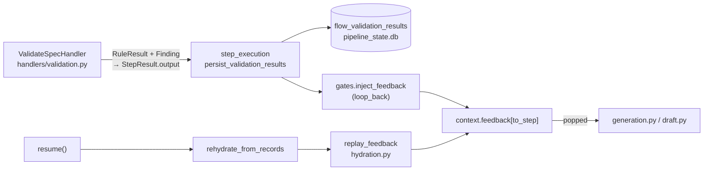

# INT-US-04 — Context-Aware Flow Orchestration Integration

**Status**: APPROVED. **CLOSED (2026-08-15). Nothing remains.** · **Phase**: 6 · **Feature ID**:
INT-US-04

| | |
|---|---|
| Connects | Validation Engine (`E-VAL-01`) · Pipeline Runner (`D-FLOW-01`) · run state (`E-FLOW-01` named originally, see below) |
| Acceptance | E2E `tests/e2e/capabilities/assurance/test_mcp_flow_e2e.py` |
| Retired SFs moved to | `B-FLOW-05` · `C-FLOW-10` · `C-INTL-04` · `D-UI-05` · `B-INTL-10` (by `ADR-003`) |
| Not touched | external systems outside the Flow Execution domain |

## What it does

Persists validation output per run, so the Pipeline Runner can fetch verified context for later
prompt generation — including after a resume. Replaces stateless in-memory context passing.

- Validation findings reach `StepResult.output` without loss (FR-1).
- They are stored in a queryable table, `flow_validation_results`, in `pipeline_state.db` (FR-2).
- A resumed run gets its `context.feedback` back, so the step that regenerates does not repeat the
  mistake validation already caught (FR-3).

## Why the pipeline state DB, not the Config DB

Scope decision, 2026-08-14 — taken by the user, from `TECH-017`'s audit. `TECH-017` recorded
`INT-US-04` C1 as the audit's single open **decision**: the contract claims the Config DB persists
Validation Engine outputs, and no such surface existed (the Config DB, `config/database.py`,
and `flow/store.py`'s `FlowRepository` supported only generic `ArtifactEvent`). Decided: **persistence was intended**.

`store.py` states the state DB is deliberately *"isolated from the configuration database"*. Per-run
validation results are runtime state, not configuration; writing them to `specweaver.db` would break
that separation and split one run's state across two files. So FR-2 and NFR-1 were amended
2026-08-14 away from the **Config DB** (`E-FLOW-01`) and its async `FlowRepository` session
(`FlowRepository` is async; `StateStore` is sync `sqlite3`). Amending them was legitimate because
SF-01 had **never been delivered**, so finished-stories-immutable did not attach.

Base contract: the `⬜ Pending` marker flipped to `✅` in `33561183` (Q-11, resolved), earned by
SF-01's persistence. C1 is recorded as **unprovable as written** (the store is `pipeline_state.db`,
not the Config DB the description names, by decision). C2's *"sanitized"* clause stays `unproven`.
Neither was re-worded to fit the `✅` — `TECH-017` `NFR-1` forbids exactly that. (Before SF-01,
`US-04_integration.md` read `✅ Complete` over unbuilt work.)

## Architecture

| Piece | Lives in |
|---|---|
| Lossless `Finding` payload | `core/flow/handlers/validation.py` |
| `flow_validation_results` + `save_validation_results` / `get_validation_results` | `core/flow/engine/store.py` (`StateStore`) |
| Write per attempt, whatever the verdict | `core/flow/engine/step_execution.py` |
| Feedback replay on resume | `core/flow/engine/hydration.py` |

Before SF-01: FR-1 extraction was **built, lossy** (`validation.py` kept
`rule_id`/`status`/`message` and dropped `Finding` — line, severity, suggestion). Step results
serialized into `flow_pipeline_runs.step_records` as an **opaque JSON blob** via `model_dump()` — not
queryable. FR-3 injection was **built in memory** only (`gates.inject_feedback` →
`context.feedback` → popped by `generation.py` / `draft.py`): `context.feedback` is an in-memory
field (`run_context.py:157`), and `rehydrate_from_records` rebuilt `plan_context` on resume
(`INT-US-21` FR-3) but **not** feedback, so a resumed run silently lost its findings. SF-01 built
on these rather than rebuilding them. Detail: [SF-01 plan](INT-US-04_sf01_implementation_plan.md).

External dependencies: none new. `StateStore` is stdlib `sqlite3` in WAL mode. The original research
listed SQLite via SQLAlchemy async mapping (`ext.asyncio.AsyncSession`, 2.0+, from `pyproject.toml`)
— it applied to the Config DB route only. No external blueprint references; driven by the existing
Flow Architecture reference.

## Decisions

| # | Decision | Rationale | Architectural Switch? |
|---|----------|-----------|----------------------|
| AD-1 | Extend `FlowRepository` | Centralizes flow state rather than adding logic to `validation` (which forbids DB I/O). | No |
| AD-2 | Use `RunContext.db` | Context is available in every pipeline step, keeping DI compatibility. | No |

AD-1 predates the 2026-08-14 scope decision; as built, the state lives in `StateStore`, flow's own
store. Boundaries: `flow` can consume `config` and `validation`.

## Functional Requirements

| # | FR | Actor | Action | Outcome |
|---|-----|-------|--------|---------|
| FR-1 | Validation Persistence | Engine | The system SHALL extract validation findings from `E-VAL-01`, **including each `Finding`'s line, severity and suggestion** | Findings are available within `StepResult.output` **without loss**. |
| FR-2 | Stateful DB Write | `StateStore` | The system SHALL persist validation results against the current `run_id` in a **queryable table in the pipeline state DB** (`flow_validation_results`), one row per rule result | Data is stored in `pipeline_state.db`, queryable by `run_id`, `step`, `rule_id`, `status`. |
| FR-3 | Context Injection | PipelineRunner | The system SHALL restore `context.feedback` from persisted validation results **on resume**, and inject it into subsequent generation steps | A resumed run regenerates against the same findings a same-session run would have seen. |

## Non-Functional Requirements

| # | NFR | Threshold / Constraint |
|---|-----|----------------------|
| NFR-1 | Performance | DB writes must not block the pipeline loop. **Amended 2026-08-14:** the original *async session* wording assumed the Config DB; `StateStore` is sync `sqlite3` in WAL mode, so the constraint is bounded write cost on the existing state connection, not an async session. |
| NFR-2 | Architecture Compliance | Changes must occur in `core.flow` or `core.config` adhering to `consumes` boundaries. **[proof: arch — tach/lint gate, not pytest]** |
| NFR-3 | Compatibility | Must pass existing E2E testing: `test_mcp_flow_e2e.py` without regressions. |

## Out of scope

- **"Sanitized" (C2).** Maps to `E-VAL-03` (AST Prompt Injection Sanitization), `🔜` unbuilt.
  `INT-US-04` C2's sanitization half stays `unproven` however SF-01 lands; SF-01 must not be widened
  to cover it.
- **Cross-run history and any query/CLI surface over it.** Run-scoped only. A history feature needs a
  consumer to justify it and would be its own sub-feature.

## Developer guides

| Guide Topic | Description | Status |
|-------------|-------------|--------|
| Pipeline Context State | How Handlers persist their outputs. | ⬜ To be written during Pre-commit |

## Sub-features

| SF | Does | FRs | Plan |
|----|------|-----|------|
| SF-01 | Core Flow DB Integration — see below | FR-1, FR-2, FR-3 | [sf01](INT-US-04_sf01_implementation_plan.md) |
| SF-03 | Parallel Multi-Spec Execution (✅ Integrated) — see below | its own | ✅ |
| SF-04 | Context Mention Highlighting (✅ Integrated) — see below | its own | ✅ |
| SF-08 | Configurable Prompt Render Profiles (✅) — see below | its own | [sf08](INT-US-04_sf08_implementation_plan.md) |

**SF-01 — Core Flow DB Integration.** The persistent handshake from validation output to **pipeline
run state**, and the resume gap that lost it. Run-scoped. Inputs: `RuleResult` findings via
`ValidateSpecHandler`. Outputs: SQLite records accessible to `GenerateCodeHandler`.

SF-01 was delivered across four commit boundaries: `e400cfdb` findings survive the handler boundary,
`3e8c29f9` queryable persistence, `9a81719f` feedback replay on resume, `b15d372f` the corrected
`context.yaml`. `check_fr_coverage.py INT-US-04` passes **3 of 3**. Read the plan's Red/Blue and the
four CB outcome notes before touching this area: five plan errors were found by reading the code the
plan named, three after approval — the write point (D-10), the row grain (D-11), the `exposes`
replacement list (D-12), and the `PENDING`-only replay condition, which W-1 disproved against a real
loop-back.

**SF-03 — Parallel Multi-Spec Execution Integration.** Multi-Spec Pipeline Fan-Out contract.

- FRs: FR-1: support hierarchical state tracking via `parent_id`; FR-2: aggregate validation findings
  from all fan-out sub-runs.
- Inputs: array of Spec Targets triggering a `fan_out` pipeline action. Outputs: hierarchical
  `ArtifactEvent` records in the DB; aggregated `StepResult`.

**SF-04 — Context Mention Highlighting Integration.** Auto Spec-Mention Detection contract.

- FRs: FR-1: query Config DB for verified state of Spec Mentions; FR-2: append retrieved state as
  supplementary context into `RunContext`.
- Inputs: list of mentioned Spec IDs detected by the Topology Graph. Outputs: sanitized context
  string with the state of the mentioned specs, injected into the prompt.

**SF-08 — Configurable Prompt Render Profiles Integration.** Integrates C-INTL-05 `RenderProfile`
into pipeline orchestration via Step Parameter Injection and a `ProfileRegistry`.

- FRs: FR-1: expose `render_profile` in `PipelineStep.params`; FR-2: provide a `ProfileRegistry` to
  resolve named profiles; FR-3: update Handlers to resolve dynamic profiles before fallback.
- Inputs: `PipelineStep` params dictionary; `ProfileRegistry` mapping. Outputs: Handlers executing
  with the dynamically resolved `RenderProfile`.
- Shipped in **`e2ac7e6e`** (2026-05-16, on `main`), *"integrate dynamic prompt render profiles into
  handlers `[INT-US-04-SF08]`"*. `render_profile` is read from `step.params` at eight handler call
  sites (FR-1); `PROFILE_REGISTRY` + `resolve_profile()` live in `handlers/_profiles.py` (FR-2);
  every call site passes a handler-specific `default=`, so a dynamic profile resolves *before* the
  fallback (FR-3). 50 tests pass across `test_handlers_profiles.py` and
  `test_build_base_prompt_profiles.py`. Tracker and plan status corrected 2026-08-14 (they had
  under-claimed: ⬜ / `DRAFT` over shipped work).

`Depends on: SF-01` on every add-on was decorative: SF-03, SF-04 and SF-08 all shipped while SF-01
was never built. Nothing waited on SF-01.

### Retired sub-features

Retired 2026-08-13 by `ADR-003`: never designed, and each one's requirements are what its owner
capability does, not observations a third document makes about it. **The FR text is kept, not
deleted**: it is the intake for the owner's design, where each becomes an FR that
`check_fr_coverage.py` enforces. Any seam it needs is an FR on the consumer; any user-visible journey
is a journey proof. Nothing is lost — the owner changed. All were Pending Design, Impl Plan ⬜, and
depended on SF-01.

**SF-02 Security Defenses Integration → `B-FLOW-05`** (Token-Burn Circuit Breakers (EDoS Prevention))

- Scope: Token-Burn Circuit Breakers (EDoS Prevention) integration contract.
- FRs: [FR-1: Record aggregate token usage per `run_id`, FR-2: Halt execution and throw
  `CircuitBreakerException` if budget exceeded]
- Inputs: Token usage metrics from `LLMAdapter` responses.
- Outputs: `CircuitBreakerEvent` logged to the Config DB; Pipeline halts securely.

**SF-05 Advanced Routing & Conditional Flows Integration → `C-FLOW-10`** (Deferred Router Mapping
Capabilities)

- Scope: Deferred Router Mapping & Interactive Gate Variables integration contract.
- FRs: [FR-1: Persist pipeline suspension states (`GATE_PENDING`, etc.), FR-2: Serialize `RunContext`
  to DB and terminate thread, FR-3: Restore `RunContext` from DB on resume trigger]
- Inputs: `GateDefinition` rules; CLI/API approval events.
- Outputs: Suspended pipeline state records; Restored execution threads.

**SF-06 Infinite Memory Management Integration → `C-INTL-04`** (Conversation Summarization (Token
compression))

- Scope: Conversation Summarization (Token compression) integration contract.
- FRs: [FR-1: Trigger summarization handler when token count exceeds threshold, FR-2: Persist
  compressed summary and mark raw history events as `ARCHIVED`]
- Inputs: Token count metrics from `RunContext`; Raw history array.
- Outputs: Compressed `SummaryContext` injected into future steps; `ARCHIVED` status applied to old DB
  records.

**SF-07 Remote UI Integration → `D-UI-05`** (REST API - Enterprise Configuration)

- Scope: REST API - Enterprise Configuration integration contract.
- FRs: [FR-1: Expose structured query boundaries for REST API fetching without executing Runner
  logic, FR-2: Flush real-time progress events to DB]
- Inputs: HTTP GET requests from the UI.
- Outputs: Read-only JSON serialization of `ArtifactEvent` and `ValidationResult` states.

**SF-09 Declarative Dynamic Prompt Routing Integration → `B-INTL-10`** (Declarative Prompt
Optimization)

- Scope: B-INTL-10 Declarative Prompt Optimization (DSPy-style routing) integration contract —
  persisting prompt profiles, compiling an optimized profile from runtime routing, telemetry and
  active models, A/B-testing prompt structures. No FRs were written.

SF-09's retirement note was recorded 2026-08-15: `ADR-003` (`bb789a29`) deleted 68 `INT-US-NN-SFNN`
lines from `master_story_roadmap.md` (8 returned as delivered or `RETIRED → owner`, 60 gone), and
SF-09 had no owner line or design-doc anchor, so the annotating sweep missed it. It never blocked
anything; `check_proof_tier.py` fires only on Design `✅` / Dev `⬜`.

`B-INTL-10` is itself `🔮` and carries a re-scope warning in `topic_04_intelligence.md`: premised on
owning slot-prompt assembly, the layer `C-INTL-06` / `C-FLOW-11` shrink — *"at design time either
re-scope the optimization target to rubric/skill content (`C-VAL-05` artifacts) or retire."* An
integration contract written for it now would target a capability that may not survive its own
design.

## Progress Tracker

A `RETIRED` row is not work: its owner is in `Depends On`, and nothing here resumes it — each is
picked up by the owner's design. The tracker holds no `⬜`: every row is delivered `✅` or
`RETIRED → <owner>`.

| SF | Name | Depends On | Design | Impl Plan | Dev | Pre-Commit | Committed |
|----|------|-----------|--------|-----------|-----|------------|-----------|
| SF-01 | Core Flow DB Integration | — | ✅ | ✅ | ✅ | ✅ | ✅ |
| SF-02 | Security Defenses Integration | RETIRED → `B-FLOW-05` | — | — | — | — | — |
| SF-03 | Parallel Multi-Spec Execution | SF-01 | ✅ | ✅ | ✅ | ✅ | ✅ |
| SF-04 | Context Mention Highlighting | SF-01 | ✅ | ✅ | ✅ | ✅ | ✅ |
| SF-05 | Advanced Routing & Conditional Flows | RETIRED → `C-FLOW-10` | — | — | — | — | — |
| SF-06 | Infinite Memory Management | RETIRED → `C-INTL-04` | — | — | — | — | — |
| SF-07 | Remote UI Integration | RETIRED → `D-UI-05` | — | — | — | — | — |
| SF-08 | Configurable Prompt Render Profiles Integration | SF-01 | ✅ | ✅ | ✅ | ✅ | ✅ |
| SF-09 | Declarative Dynamic Prompt Routing Integration | RETIRED → `B-INTL-10` | — | — | — | — | — |
