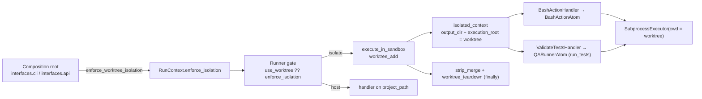

# INT-US-09 — Zero-Trust Sandbox: Base Integration Contract

**Status**: APPROVED — approved by Steve Bula on 2026-07-16 (amended 2026-07-16 during
impl-planning: rebind scope narrowed to surfaces that *execute* untrusted content — `action: bash`
and `run_tests`/pytest — explicitly excluding static-analysis QA like `lint_fix`/ruff, which parses
but never executes code). **COMPLETE** 2026-07-17 (CB-1 `85d02be4`, CB-2 `f4077870`, CB-3
`bd6913c6`, CB-4 `474490ae`). · **Phase**: 6 · **Feature ID**: INT-US-09

| | |
|---|---|
| Integrates | US-5 Core (Git Worktree Bouncer / `D-EXEC-02`) · `E-EXEC-01` (Standard Local Execution / `SubprocessExecutor`) · `C-EXEC-02` (Native CLI Action Nodes / `BashActionAtom`) |
| Touches | `core.flow.engine` (runner / runner_utils / handlers) · `sandbox.execution.core` · `sandbox.git.core` (`GitAtom` worktree intents) · `core.config` (`SandboxSettings`) · composition root (`interfaces.cli` / `interfaces.api`) |
| Not touched | containerization (`B-EXEC-01`, `D-EXEC-01`, Podman/Docker, `ContainerSubprocessExecutor`) · add-on slots INT-US-09-SF01..SF04 |
| Extended by | `C-EXEC-06` (per-run session isolation, delivered as INT-US-09-SF05) · `C-EXEC-07` / `INT-US-09-SF06` |
| Companion | `docs/roadmap/topics/topic_08_integration/US-09_integration.md` — the reframed (non-container) Base Story Contract text |

## What it does

Wires three already-built capabilities into one enforceable, **container-free** host-execution flow
for US-9 ("The Zero-Trust Sandbox"):

- a **boundary hand-off** that binds process execution to the worktree;
- an **opt-in isolation policy** (`[sandbox] enforce_worktree_isolation`);
- a combined end-to-end proof.

It is an integration contract, not a capability build: no new execution mechanism.

Constraints: strictly container-free; zero regression to host execution; isolation off by default;
wiring only in the flow orchestration layer / composition root using atom surfaces, never inside
`sandbox/*`; respects `tach.toml` / `context.yaml` and ADR-002 (generic engine, config frozen at the
composition root).

## Why — the coordination gap

The three capabilities were three independently anchored boundaries (line refs in the
[plan](INT-US-09_implementation_plan.md)):

- **Worktree isolation communicated only via `RunContext.output_dir`.** `execute_in_sandbox(...)` cloned the
  run context and set only `isolated_context.output_dir = context.project_path / wt_path`; it
  rebound no execution boundary. Triggered per step by `PipelineStep.use_worktree` — which no
  pipeline YAML set, so isolation was reachable only by manual step authoring.
- **The executor boundary is its constructor `cwd`**, fixed at construction, and
  `SubprocessExecutor` is built per caller at ~18 sites, each keying `cwd` off
  `context.project_path`. No central executor factory exists whose boundary the worktree flow could
  rebind — the structural reason for the gap.
- **`BashActionAtom` ran against the project root even inside a sandboxed step.**
  `BashActionHandler._get_atom` built `BashActionAtom(cwd=context.project_path)`; the atom resolves
  scripts against `<project>/.specweaver/scripts/` and builds `SubprocessExecutor(cwd=self._cwd)` with `_cwd = project_path`.
  It never read `output_dir`, so a `use_worktree: true` bash step executed against the real repo
  root.

## Architecture

Reuse only — nothing is rebuilt: `GitAtom` worktree intents (`worktree_add` / `worktree_sync` /
`strip_merge` / `worktree_teardown`, `src/specweaver/sandbox/git/core/atom.py`),
`BashActionAtom.run(context)`, `SubprocessExecutor` (security boundary) and `execute_in_sandbox`
(the US-5 orchestration seam). The "Main-Branch Wins" strip-merge (out-of-bounds hunks erased per
`context.yaml`, then `git apply --strategy-option=ours`; shared docs like `README.md`/`docs/*`
hard-forbidden) is existing US-5 behavior, preserved.

| Change | Lives in |
|---|---|
| `enforce_worktree_isolation` setting | `core.config` `SandboxSettings` |
| Policy resolution onto `RunContext.enforce_isolation` | composition root (`interfaces.cli`; `interfaces.api` via `TECH-013`) |
| `RunContext.execution_root`, tri-state `use_worktree`, gate resolver | `core.flow` (handlers / engine) |
| Boundary hand-off | `BashActionHandler`, `ValidateTestsHandler` `_get_atom` |

**Boundary rules** (authoritative: `tach.toml` + `context.yaml`):

- `core.flow` **may** consume `sandbox.execution.core` and `sandbox.git.core` (`tach.toml:41-42,156-158`;
  `core/flow/context.yaml:26-30`) — one-way, `flow → sandbox` only. The reverse is forbidden
  (`sandbox/execution/context.yaml:10-12` → `forbids: [sandbox.qa_runner.*, core.flow.*]`).
- `core.flow` **forbids** `sandbox/*/interfaces` (`core/flow/context.yaml:34-35`) — the engine uses
  **atom** surfaces (`GitAtom`, `BashActionAtom`), not agent-facing tools.
- `core.config` is **pure-logic** and forbids `sandbox/*` — subprocess/worktree config surfaces as a
  passive `SandboxSettings` object injected into flow, not a sandbox import.
- **ADR-002** (`docs/architecture/07_architectural_decision_records/adr_002_composition_root_vs_factories.md`):
  the flow engine stays a **generic orchestrator**; SpecWeaver-specific config is frozen at the
  **composition root** (`interfaces.cli` / `interfaces.api`) and passed in pre-hydrated — never
  welded into the engine, never fetched via atoms mid-pipeline (blocks the event loop / breaks
  snapshot isolation). **ADR-001** confirms the Git Worktree Sandbox is the chosen isolation model.
- Avoid: raw `subprocess`/`os`/`git` in the engine (route through atoms — Feature 3.32 SF-04
  precedent); inline/lazy imports to dodge `tach`; parallel security mechanisms.

**Dependencies** — no new third-party dependency, no API incompatibility → no dependency gate:

| Tool | Min Version | Key API Surface | Compat Confirmed | Notes |
|------|------------|----------------|-----------------|-------|
| Git CLI | already required by US-5 | `git worktree add/remove`, `git apply --strategy-option=ours` via `GitAtom` | Y | Existing US-5 / `D-EXEC-02` worktree ops. |
| SubprocessExecutor (E-EXEC-01) | in-repo | `execute()` with constructor-time `cwd` boundary, credential stripping, resource limits (`src/specweaver/sandbox/execution/executor.py`) | Y | Rebinding = constructing an executor bound to the worktree path. |

Origin patterns (`docs/ORIGINS.md:170-191`): **Archon** ("Workflow Orchestration & Isolation …
deterministic and repeatable through YAML DAGs and git worktrees"; Bash/Script DAG Nodes →
SpecWeaver's `action: bash` steps resolving bare script names against `.specweaver/scripts/`) and
**Cavekit** (Work Packet Bundling clustering components into shared Git Worktrees).

## Decisions

| # | Decision | Rationale | Architectural Switch? |
|---|----------|-----------|----------------------|
| AD-1 | All integration/wiring lives in `core.flow` (engine + handlers) and the composition root; the engine drives `GitAtom` / `BashActionAtom` via the uniform `Atom.run(context)` contract — never raw `subprocess`/`os`/`git`. | `tach.toml`/`context.yaml` permit one-way `flow → sandbox.core` only; sandbox must stay engine-agnostic; SF-04 precedent forbids raw filesystem/process ops in the engine. | No |
| AD-2 | Introduce a generic **execution-root** on `RunContext` (default = `project_path`); `execute_in_sandbox` sets it to the worktree source-tree path, and the **in-scope untrusted-*execution* surfaces — `BashActionHandler` → `BashActionAtom` and `ValidateTestsHandler` → `QARunnerAtom` for the `run_tests` (pytest) path** — construct their atom/executor `cwd` from it instead of `project_path`. Static-analysis QA (`LintFixHandler`/ruff, complexity, architecture — parse but do not execute) and every other process-spawning site remain project-root-bound for now (documented limitation, incremental adoption — not a regression, since their default is unchanged). | The executor boundary is a constructor-fixed `cwd`; propagating `output_dir` alone cannot rebind execution. An engine-generic "where processes run" field keeps atoms ignorant of the engine. Scoping to surfaces that *execute* untrusted content (a trusted tool — `pytest`/`bash` — running LLM-authored files) bounds the change; static analysis (`ruff`/`tach`) never executes the code, so isolating it adds risk without security benefit. | No |
| AD-3 | The US-9 isolation policy is a `SandboxSettings` field resolved at the **composition root** (where `RunContext` is assembled for a run — `interfaces.cli` / `interfaces.api` pipeline invocation; exact call site pinned in the impl plan, consistent with how `SpecWeaverSettings.sandbox` already reaches the run) and carried into `RunContext`. The step flag becomes **tri-state** (`use_worktree: bool \| None`): `None` → policy decides; `True`/`False` → explicitly honored over the policy. The runner gate resolves `explicit-step-value ?? context.enforce_isolation`. Default (policy off, flag `None`) → today's behavior. | ADR-002: config frozen at the composition root, engine reads a passive flag (no step classification). Tri-state is required to distinguish an explicit opt-out from "unset" (a plain `bool=False` cannot). Preserves backward compatibility (NFR-1); existing explicit `True` steps stay valid. | No |
| AD-4 | Scope the isolation guarantee to the **worktree source tree**. Preserve `.specweaver/scripts/` canonical containment under the rebind (fail-closed `WorkspaceBoundary` at load + pre-exec, `shutil.which()` bash resolution unchanged). Intentionally-shared, symlinked paths (`.specweaver/` caches, dep caches, `reservations.db`) are **outside** the isolation boundary by existing US-5 design — the e2e proof (FR-6) asserts *source-tree* isolation specifically, not shared-cache isolation. | C-EXEC-02 security invariants + the path-containment (CVE-2025-54794) lesson must survive the boundary move; honesty about the shared-cache seam prevents a false isolation claim. Broadening isolation to shared caches is a separate, later concern (and partly what the container add-on SF01 addresses). | No |
| AD-5 | Verifiable Proof is a real-worktree, unmocked e2e test under `tests/e2e/sandbox/`, using the collection-time clean-skip pattern for any optional prerequisite. | `testing_guide` conventions; the roadmap Proof Mandate; the §23 corollary that a mocked unit test cannot catch host-path assumptions — pair with a real execution. | No |

No decision is an Architectural Switch — the integration fits within existing `consumes`/`forbids`
rules, archetypes and ADRs.

## Functional Requirements

| # | FR | Actor | Action | Outcome |
|---|-----|-------|--------|---------|
| FR-1 | Execution-boundary hand-off | PipelineRunner | When an **in-scope untrusted-*execution* surface** — a `action: bash` step (`BashActionAtom`) or a test run (`ValidateTestsHandler` → `run_tests` / pytest) — runs under worktree isolation, the system SHALL bind the process-execution boundary (the `SubprocessExecutor` `cwd`) to the worktree **source-tree** path rather than `project_path`. Static-analysis QA (lint/complexity/architecture, which parse but never execute the code) and all other handlers remain project-root-bound (documented limitation; see AD-2). | In-scope processes that *execute* LLM-authored content read/write within the worktree source tree, not the real source root. |
| FR-2 | Bash worktree containment | BashActionHandler / BashActionAtom | A `action: bash` step running under isolation SHALL resolve its script and `working_dir` against the worktree source tree, preserving canonical-path containment and fail-closed validation. | Bash scripts execute worktree-bounded; the real source tree is not directly mutated. (Intentionally-shared symlinked caches — `.specweaver/`, dep caches — are outside the isolation boundary by US-5 design; see AD-4.) |
| FR-3 | Isolation enablement policy | Composition root (CLI/API) | The system SHALL expose a US-9 isolation policy as a `SandboxSettings` field, resolved at the composition root and carried into `RunContext`, that when enabled makes worktree isolation the **default** for pipeline steps; a step MAY still explicitly opt out. When the policy is disabled or absent, behavior is identical to today (per-step opt-in only). | Operators enforce host-sandbox isolation via config, without editing pipelines, with no behavior change when off and an explicit per-step escape hatch. |
| FR-4 | Unified security boundary | SubprocessExecutor | Every isolated execution (bash script; `run_tests`/pytest) SHALL retain E-EXEC-01's guarantees: credential stripping, env allowlist, resource limits, timeout escalation, and `cwd` containment. | No untrusted-execution path bypasses the executor's security boundary when isolation is active. |
| FR-5 | Strip-merge preservation | GitAtom | Changes produced inside the worktree SHALL be reconciled back via the existing "Main-Branch Wins" `strip_merge` (out-of-bounds hunks stripped per `context.yaml`; shared docs forbidden). | Only allowed paths merge back to the source tree; the integration does not weaken US-5. |
| FR-6 | Verifiable proof | Test suite | The system SHALL provide an end-to-end test whose primary proven surface is a real `action: bash` step running inside a real git worktree, asserting its writes land in the worktree source tree and the real source root is not directly mutated; a `run_tests`/pytest execution under isolation is asserted as an additional case where a test step runs isolated. | The contract's "Verifiable Proof" is satisfied by a runnable, unmocked e2e test. |

## Non-Functional Requirements

| # | NFR | Threshold / Constraint |
|---|-----|----------------------|
| NFR-1 | Backward compatibility | With the isolation policy absent/disabled and no per-step `use_worktree`, execution is byte-identical to today; no existing pipeline definition changes. |
| NFR-2 | Architecture compliance | All wiring in `core.flow` (engine/handlers) + composition root; atom surfaces only (`GitAtom`, `BashActionAtom`); no raw `subprocess`/`os`/`git` in the engine; config as passive `SandboxSettings` (ADR-002); imports declared at module top and registered in `tach.toml` (no lazy-import boundary dodges). **[proof: arch — tach/lint gate, not pytest]** |
| NFR-3 | Security | Credential stripping + env allowlist + `cwd` containment preserved on every isolated path; `.specweaver/scripts/` canonical containment fail-closed (checked at load and immediately pre-exec); `bash` resolved to an absolute path via `shutil.which()` (never the bare string). |
| NFR-4 | Platform | Works on Windows + Linux; reuse US-5's resilient worktree-teardown backoff for Windows file locks; no OS-specific regression. |
| NFR-5 | Observability | DEBUG-level lazy `%s` logging of command / cwd / timeout / exit_code / duration; handlers surface `files_touched`. |
| NFR-6 | Performance | Worktree add/teardown overhead is incurred only when isolation is active; the default (non-isolated) path adds zero overhead. |
| NFR-7 | Proof tier | Verifiable Proof is a real e2e test using real git worktrees + at least one real unmocked execution; if any optional prerequisite is unavailable, skip cleanly at collection time (no exclusion marker) — none is expected since git is always present. **[proof: meta — rule about tests, docs or the diff]** |

## Risks

| Risk | Probability | Impact | Mitigation |
|------|-------------|--------|------------|
| Rebind silently breaks `.specweaver/scripts` containment | Med | High | AD-4: keep `WorkspaceBoundary` fail-closed (load + pre-exec); e2e asserts containment; unit tests for path resolution under worktree. |
| Handlers other than bash/QA still anchor to `project_path` | Med | Med | Document execution-root as the canonical spawn root; audit all process-spawning handlers; leave non-audited paths on default (project_path) = no regression. |
| Windows worktree teardown file-lock flakiness | Med | Low | Reuse US-5's progressive-backoff teardown in a `finally`. |
| Enforcement-by-default surprises an existing pipeline | Low | Med | NFR-1: policy defaults off; enabling is an explicit operator action. |

Open: the ~18 per-caller `SubprocessExecutor` constructions share no boundary; the execution-root
convention gives a single worktree-aware source of truth for spawn `cwd`, adopted incrementally
(effort M, out of scope).

Developer guides (delivered at CB-4): `pipeline_engine_guide.md` §7 (Worktree Bouncer) — isolation
rebinds the **execution boundary** (execution-root), not just `output_dir`, and how the policy
enables it; `subprocess_execution.md` — the execution-root convention for `cwd` under isolation.

## Sub-features

**Single feature — no decomposition.** FR-3 (policy) and FR-6 (proof) are inert without
FR-1/FR-2/FR-4 (the hand-off), and no FR subset ships independent value, so splitting would break
the self-containment rule and collapse into one dependency chain. One un-suffixed plan
([INT-US-09_implementation_plan.md](INT-US-09_implementation_plan.md), following the `D-EXEC-01`
single-feature precedent), organized by commit boundaries.

- **FRs**: [FR-1, FR-2, FR-3, FR-4, FR-5, FR-6]
- **Inputs**: `RunContext` (project_path, output_dir, env), `SandboxSettings` (new isolation policy)
  from the composition root, `PipelineStep.use_worktree`, existing `GitAtom` / `BashActionAtom`.
- **Outputs**: worktree-bounded process execution; a config-driven isolation policy; a passing
  real-worktree e2e proof; updated dev guides.
- **Depends on**: none (US-5 Core, E-EXEC-01, C-EXEC-02 all committed).

Add-on sub-stories — separate integration contracts, each blocked on (or deferring integration of)
its own capability; **out of scope** here:

| Slot | Add-on | Underlying capability | Status |
|------|--------|-----------------------|--------|
| INT-US-09-SF01 | Containerized Isolation | `D-EXEC-01` ✅ + `B-EXEC-01` ✅ (built) | Integration Pending Design — separate contract, container-scoped |
| INT-US-09-SF02 | Security Defenses | `E-EXEC-02` (unbuilt) | Blocked on capability |
| INT-US-09-SF03 | Extreme Execution Paranoia | `A-EXEC-01` (unbuilt) | Blocked on capability |
| INT-US-09-SF04 | Mathematical Speed & Security (Rust) | `A-EXEC-03` (descoped 2026-08-20) | Terminal — scope descoped with its capability by the benefit review |

## Progress Tracker

| SF | Name | Depends On | Design | Impl Plan | Dev | Pre-Commit | Committed |
|----|------|-----------|--------|-----------|-----|------------|-----------|
| — | Core Zero-Trust Host-Execution Integration (single feature) | — | ✅ | ✅ | ✅ | ✅ | ✅ |

Delivered across 4 commit boundaries: CB-1 config surface + composition-root policy wiring
(`85d02be4`), CB-2 execution-root + tri-state gate (`f4077870`), CB-3 boundary hand-off in the
untrusted handlers (`bd6913c6`), CB-4 real-worktree e2e proof + fail-closed + docs (`474490ae`). Container
neutrality applied (does not activate B-EXEC-01 container QA on `sw run`). API-run policy wiring
was deferred to Backlog, later closed by `TECH-013`.
