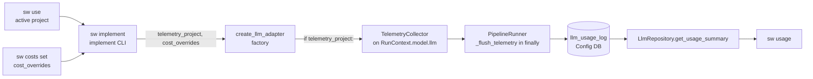

# INT-US-16 — US-16 Base Integration Contract: AI Operations & Cost Routing

**Status**: COMPLETE (2026-08-16). Approved with FR-2 kept in this contract per `AD-4`; FR-1 split
into FR-1/FR-4 during CB-2 per `A.1c`. CB-1 `c8be134c`, CB-2 `f7a98a4c`. · **Phase**: Integration
(Topic 08) · **Feature ID**: INT-US-16

| | |
|---|---|
| Joins | `C-FLOW-01` (Telemetry DB) · `D-FLOW-03` (Static Routing) · token tracking · the Config DB |
| Touches | the implement CLI's adapter construction · `TelemetryCollector` · `PipelineRunner._flush_telemetry` · `LlmRepository.get_usage_summary` · the `sw usage` renderer |
| Not touched | the unbuilt US-16 add-ons: dynamic routing, friction analytics, OpenTelemetry tracing, REST telemetry API |
| Minted from this work | `C-FLOW-13` / `D-FLOW-05` — whether the recorded number is *right* |

## What it does

Proves the US-16 journey end to end: a real `sw implement` run records its LLM token usage and
cost, and `sw usage` then shows that run's spend for the active project.

Constraints: no live API calls in the proof; one surface proven end to end rather than six proven
shallowly.

## Why

US-16's base contract was `[Pending definition...]` — one of three reserve epic-closers in the
routing queue. Every US-16 MVS capability was delivered, and the machinery is correctly wired — checked, not
assumed, and the opposite of what the `INT-US-25` precedent predicted. **Nothing joined them.** No
test ran a SpecWeaver command and then asserted that command's cost was visible. The proof was cut
in two, and the halves met at a hand-written `sqlite3` INSERT:

| Existing test | Enters at | Ends at |
|---|---|---|
| `tests/integration/test_telemetry_roundtrip.py`, `tests/e2e/capabilities/infrastructure/test_telemetry_e2e.py` | the **factory**, called directly | DB rows |
| `tests/integration/test_telemetry_integration.py::test_flush_data_queryable_via_get_usage_summary` | the **collector** | `get_usage_summary` |
| `tests/e2e/test_cli_decentralized_e2e.py::test_usage_e2e_happy_path` | a **hand-written `sqlite3` INSERT** naming ten columns as literals | `sw usage` output |

If the writer's column set drifted, both halves would stay green — the `INT-US-25` failure mode one
step less severe: not a dead capability, but a seam that meets at a fixture instead of at a run.

Joining them exposed two defects, both fixed here:

- **No active project** → `sw implement` refuses with `Error: LLM configuration failed: Project
  'None' not found` — a database lookup that failed on the string `None`, rather than "you have
  not run `sw use`". A message defect, not lost money (AD-5). The `# type: ignore[arg-type]` beside
  the call silences the type checker; the runtime does raise.
- **`sw costs set` reached no run.** No command passed `cost_overrides` into
  `create_llm_adapter`, so a configured rate was echoed back by `sw costs` and then ignored (FR-4).

## Architecture

Where the pieces are, and the wiring as found:

- `TelemetryCollector` wraps the adapter when a project is given — in the factory, and again in
  the router for the routed path.
- `PipelineRunner._flush_telemetry` drains it in a `finally`, so a failed run still records what it
  spent.
- All six LLM-calling surfaces pass `telemetry_project`: `sw run` and `sw resume`, `sw implement`,
  `sw review` ×2, drift, plus both REST routes.
- `sw usage` and `sw costs` render real aggregates.

File and line references: [plan §Where it plugs in](INT-US-16_implementation_plan.md).

**Modules touched**: `workflows/implementation/interfaces/cli.py` (delivery layer — the message and
the cost pass-through), `workflows/review/interfaces/cli.py` (same two fixes),
`infrastructure/llm/factory.py` (`build_adapter_for_project`), plus new tests. No new module, no
schema change, no new dependency. `infrastructure/llm`'s `context.yaml` (`consumes:
specweaver/config`, `forbids: specweaver/sandbox/*`) is not approached.

Blueprint: `docs/ORIGINS.md:64` — token budget awareness ("Step 9a"), the origin of the
token-tracking half. It is a prose label, not a capability ID, which is why the roadmap's
`✅ Step 9a: Token Tracking` line is the one US-16 MVS entry no gate can resolve.

## Decisions

| # | Decision | Rationale | Architectural Switch? |
|---|----------|-----------|----------------------|
| AD-1 | Warn and continue when no active project, rather than refusing to run | Refusing would break every current no-project invocation, and `sw implement --project <path>` works today without `sw use`. Deriving a fallback key from the path would silently create a second telemetry identity for one project. Chosen by the user, 2026-08-16. AD-5 later found there is no run to continue: the command already refuses | No |
| AD-2 | The FR-1 e2e doubles the provider at `factory._get_adapter_class`, never at `create_llm_adapter` | **`tests/scripted_llm.py::scripted_world` cannot be used here.** It patches `create_llm_adapter` to return a bare `ScriptedLLM`, so `context.model.llm` would not be a `TelemetryCollector`, `flush_telemetry` would return early, and the test would pass while proving nothing. Patching the factory would also skip the exact `if telemetry_project:` branch FR-3 is about | No |
| AD-3 | One surface end to end, not six | Five of the six CLI surfaces exercise the identical collector → flush → `get_usage_summary` path; repeating the journey on each re-proves one seam and buys coverage of no new code. Chosen by the user, 2026-08-16 | No |
| AD-4 | The contract carries the FR-2 fix rather than deferring it to a separate ticket | `ADR-003` sequencing: the journey test is written first and must be able to go green inside its own boundary. Splitting the fix into another ticket would leave a planned red at commit, which is the shape `check_proof_tier.py` exists to catch. **Confirmed by the user 2026-08-16**, against the alternative of a separate TECH ticket | No |
| AD-5 | **Amended 2026-08-16: FR-2 is a message fix, not a silent-spend fix.** | Without an active project the command **refuses**: `load_settings(db, None)` raises first, so `create_llm_adapter` is never reached, no adapter is built, and `PipelineRunner` is never constructed. No untracked spend — only a cryptic message. Pinned by `TestImplementInstallsTelemetryCollector::test_no_active_project_stops_the_command_before_any_adapter_is_built`. Replaced the first reading, *"a run without an active project proceeds and records nothing, silently"*, reasoned from `telemetry_project=None` skipping the collector wrap and never run. **No telemetry opt-out setting exists anywhere** in `src/`, so the message names the remedy rather than implying a toggle | No |
| AD-6 | FR-1 prices the run via `sw costs set` inside the test | `estimated_cost` for an unknown model is `0.0`, so a "cost > 0" assertion would fail for the wrong reason. Setting a rate first makes the figure deterministic **and** pulls `sw costs` into the journey — the other half of the US-16 benefit, *"how much money"*. `test_costs_e2e_happy_path` already proves `sw costs set` persists | No |

## Functional Requirements

| # | FR | Actor | Action | Outcome |
|---|-----|-------|--------|---------|
| FR-1 | The journey, in tokens | `sw implement` → `sw usage` | A real `sw implement` run with an active project set, driven by a doubled provider adapter, SHALL persist its LLM usage; a subsequent `sw usage` SHALL display that run's token counts, attributed to that project and to no other | The larger half of *"see exactly how much each agent is spending"*, proven by one test crossing the whole seam rather than two meeting at a hand-seeded row |
| FR-4 | The journey, in money | `sw costs set` → `sw implement` → `sw usage` | The USD figure `sw usage` displays SHALL be priced from a rate the user set with `sw costs set`. **Split out of FR-1 on 2026-08-16**: no command passes `cost_overrides` into `create_llm_adapter`, so a configured rate is echoed back by `sw costs` and then ignored | The money half is a separate claim because it is separately broken. Keeping it inside FR-1 would have held a working journey hostage to a pricing bug |
| FR-2 | The refusal names its own cause | `sw implement` | When no active project is set, SHALL fail with a message naming the condition and the remedy (`sw use <name>`) instead of `LLM configuration failed: Project 'None' not found`. Exit code stays 1 | A user who forgot `sw use` is told so, rather than being shown a database lookup that failed on the string `None`. **Amended 2026-08-16 — see AD-5** |
| FR-3 | The collector actually reaches the runner | `sw implement` | With an active project set, the adapter that **the `implement` command itself constructs** SHALL be a `TelemetryCollector` on `RunContext.model.llm`, so `PipelineRunner._flush_telemetry` drains it rather than returning early. The test SHALL drive that construction, never build a `RunContext` by hand | The `isinstance` guard in `flush_telemetry` is satisfied by construction, and the silent-no-op path has a test that fails when it regresses |

### Requirement–surface bindings

| FR | Data needed | Provider · surface | Verified how |
|---|---|---|---|
| FR-1, FR-4 | per-call token/cost rows, grouped for display | `C-FLOW-01` · `LlmRepository.get_usage_summary(project: str \| None = None, since: datetime \| None = None) -> list[dict[str, Any]]` | read `infrastructure/llm/store.py:215-219` |
| FR-1, FR-4 | the flush that writes them at run end | flow engine · `flush_telemetry(context: RunContext, logger: Logger) -> None`, called from `PipelineRunner._flush_telemetry` in a `finally` | read `core/flow/engine/telemetry.py:20-35`, `core/flow/engine/runner.py:300-314` |
| FR-1, FR-4 | a doubled provider that leaves the real factory intact | `infrastructure/llm` · `factory._get_adapter_class` | read `tests/e2e/capabilities/infrastructure/test_telemetry_e2e.py:172` |
| FR-2 | whether an active project exists | config repo · `get_active_project()` via `_core.run_repo_op` | read `workflows/implementation/interfaces/cli.py:216` |
| FR-3 | the condition under which the collector is installed | `infrastructure/llm` · `create_llm_adapter(settings, *, telemetry_project: str \| None = None, cost_overrides=None)`, which wraps only `if telemetry_project:` | read `infrastructure/llm/factory.py:39-44,84-92` |

Every surface provides what its FR needs, so no provider requires a new FR and the A.1d
cross-story gate does not fire. All FRs cross a module boundary, so **none is a unit-tier claim** —
FR-1 and FR-4 are e2e, FR-2 and FR-3 are integration.

## Non-Functional Requirements

| # | NFR | Threshold / Constraint |
|---|-----|----------------------|
| NFR-1 | Telemetry never breaks the run | A flush failure SHALL be logged and swallowed, never propagated. Carried from the surface: `TelemetryCollector.flush` documents *"Never raises — telemetry failures are logged, not propagated"* (`collector.py:159-167`) |
| NFR-2 | The proof makes no live API call | The e2e SHALL double the provider at `factory._get_adapter_class`, **not** at `create_llm_adapter`, so the real telemetry branch under test still executes. **[proof: meta — rule about tests, docs or the diff]** |
| NFR-3 | Backward compatible | No schema change, no new CLI flag, no change to `sw implement`'s exit codes — a run with no active project still exits 1, with a better message. **[proof: meta — rule about tests, docs or the diff]**: constrains what the change may contain, not what the code does at runtime |
| NFR-4 | The warning is legible on a wrapped terminal | The FR-2 assertion SHALL go through `tests/rendering.py::shows()`, since Rich soft-wraps at `COLUMNS` and a raw `in` check passes or fails on terminal width (`TECH-017`, twice, in cited proofs). **[proof: meta — rule about tests, docs or the diff]** |
| NFR-5 | FR-1/FR-4 cannot pass on an empty table | **[proof: meta — rule about tests, docs or the diff]** `sw usage` prints *"No usage data recorded"* and **exits 0**, so asserting the exit code proves nothing. The e2e SHALL assert the scripted model name, a token count matching the scripted payload, and a non-zero USD figure, against an isolated `tmp_path` DB so no other test's rows can satisfy it |

## External Dependencies

No new dependency; these are the versions the paths already run on.

| Tool | Min Version | Key API Surface | Compat Confirmed | Notes |
|------|------------|----------------|-----------------|-------|
| typer | 0.21 | `CliRunner.invoke(app, args)` | Yes | `pyproject.toml:13`; used by every CLI test in the repo |
| sqlalchemy[asyncio] | 2.0.0 | async session + `select(...).group_by(...)` behind `LlmRepository` | Yes | `pyproject.toml:18`; no new query is written |
| aiosqlite | 0.20.0 | async SQLite driver under the Config DB | Yes | `pyproject.toml:19`; unchanged |

## Risks

| Risk | Probability | Impact | Mitigation |
|------|-------------|--------|------------|
| The e2e turns out to need a live API key | Low | High | AD-2's patch point is already proven by `test_telemetry_e2e.py:172`; the e2e is written first, so this surfaces at the red, not at the end |
| The journey needs more of the implement loop than can run in a test (spec file, project init, DB) | Medium | Medium | `test_cli_decentralized_e2e.py` already does `init` → `use` → command in one `CliRunner` session; reuse that shape |
| FR-2's warning becomes noise for users who never want telemetry | Low | Low | It fires only when no active project is set, which is already the unusual case |

## Follow-ups

| Item | Now | Later |
|---|---|---|
| `test_usage_e2e_happy_path` | Hand-writes a `llm_usage_log` row with ten literal column names, so schema drift cannot fail it | No longer the only join between writer and reader; keep as a pure read-path test or narrow it |
| `sw run`, `sw resume`, `sw review`, drift | Same `get_active_project()` → `telemetry_project` shape | FR-2's guard could lift into one shared helper once a second surface needs it. The `tach` boundaries refused three homes — see the plan's duplication baseline |
| Roadmap `✅ Step 9a: Token Tracking` | A legacy prose label with no capability ID, so no gate can resolve or verify it | Out of scope; recorded so it is not lost |
| Is the number *right*? | The contract proves the number reaches the screen | `C-FLOW-13` / `D-FLOW-05`. Next: dogfood |

## Sub-features

**Single feature — no decomposition.** 4 FRs (≤ 5), one source module touched at design time
(≤ 3), no external integration, one capability area. Two commit boundaries, in the
[implementation plan](INT-US-16_implementation_plan.md).

## Progress Tracker

| SF | Name | Depends On | Design | Impl Plan | Dev | Pre-Commit | Committed |
|----|------|-----------|--------|-----------|-----|------------|-----------|
| — | Single feature | — | ✅ | ✅ | ✅ | ✅ | ✅ |

Closure gate green: `check_fr_coverage.py INT-US-16` exits 0, `tests.py feature INT-US-16` ok on
integration and e2e.
