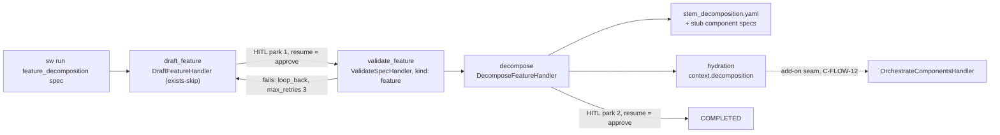

# INT-US-21 — Autonomous Feature Decomposition (Base Integration Contract)

**Status**: COMPLETE (2026-07-28) — US-21 epic closed. Design APPROVED (user, 2026-07-25). ·
**Phase**: Integration (Topic 08) · **Feature ID**: INT-US-21

| | |
|---|---|
| Wires | `D-INTL-02` (SpecKind, DecomposeFeatureHandler, `feature_decomposition.yaml`) · `D-INTL-03` (PlanSpecHandler) |
| Used by | `C-FLOW-12` + `INT-US-21-SF02` — autonomous DAG *execution*, sequenced behind `C-EXEC-07` and `TECH-014` |
| Precedent | INT-US-02/03/24: verifiable proof on the real CLI, standard display/exit-code contract |
| Re-validation | of the delivered `INT-US-21-SUB` / `C-INTL-01` → `TECH-018` (AD-9) |
| Not touched | recursive decomposition (`C-INTL-01`/`INT-US-21-SF01`, delivered); DAL-escalated run isolation (`C-EXEC-07`/`INT-US-09-SF06`) |

## What it does

A user hands an epic-level (feature-kind) spec to `sw run feature_decomposition <spec>`. The system
validates it at feature thresholds, decomposes it into a DAG of small, DAL-rated, testable
sub-components, persists the reviewed DecompositionPlan as a durable artifact plus stub component
specs, and completes through the HITL review gates via `sw resume`.

Touches the flow engine (runner, gates, registry, handlers), `workflows/drafting` (FeatureDrafter
exposure), and the pipeline YAML/state store.

Constraints: base contract = Core-Required MVS only. The add-on seams MUST be frozen
forward-compatible so `C-FLOW-12` integrates on top of the base without rework (user mandate,
2026-07-24).

## Why it was needed

The capabilities were built but not integrated. Four inherited gaps (line refs in the
[SF-01 plan](INT-US-21_sf01_implementation_plan.md) §Where it plugs in):

1. **Unrunnable shipped pipeline** — `draft+feature` / `validate+feature` had no registered handler;
   `FeatureDrafter` was unexposed.
2. **`context.plan` populated nowhere** — and two colliding plan concepts read the one field. INT-US-24
   AD-5 bequeathed this gap here.
3. **No HITL approval semantics** — resume re-parked forever (proven empirically). INT-US-02's E6/E7
   were vacuously green because PARKED and COMPLETED both exit 0. No test drove a bundled pipeline
   THROUGH a HITL gate.
4. **No decomposition artifact** — D-INTL-02 §6.2 promised `<name>_decomposition.yaml` + stub
   Component Specs; never shipped. `feature_name` fell back to `"unknown_feature"`.

FR-4 is the most valuable result and is not about decomposition: park→resume now works
**engine-wide**, for every HITL pipeline (US-2, US-24, future), and INT-US-02's vacuous proofs are
made honest.

## Why this way

Planner → DAG-executor with a persisted plan artifact, explicit state-machine HITL pauses and a
replanner loop is the standard shape (Planner-Executor Agentic Framework, emergentmind.com;
skywork.ai 2025 workflow patterns; zylos.ai long-running agents 2026-01). SpecWeaver had all the
pieces; this contract wires them.

Grill-style authoring (D-INTL-04/D-INTL-07) is upstream and decoupled — gates stay
authoring-agnostic (draft.py carries the "D-INTL-07 supersession target — do not invest in prompt
shaping" marker).

No external dependency: stdlib `graphlib`, existing `ruamel.yaml`, the existing SQLite store — all
already in pyproject.toml.

## Architecture

| Piece | Lives in |
|---|---|
| `DraftFeatureHandler`; `(DRAFT, FEATURE)` / `(VALIDATE, FEATURE)` registry rows | `core/flow/handlers/draft.py`, `registry.py` |
| Plan hydration (post-step hook + resume rehydration, one function) | `core/flow/engine/hydration.py` |
| Approve-on-resume | `core/flow/engine/approval.py` |
| Artifact, stub specs, DAL summary | `core/flow/handlers/decomposition_artifacts.py` |
| Bare-name spec resolution | `core/flow/interfaces/spec_path_resolution.py` |

Boundaries: tach already allows `core.flow → workflows.drafting/planning` (no new edge).
`core/flow/context.yaml` `forbids: specweaver/drafting` — already bent by `DraftSpecHandler` via
inline import; AD-3 extends that seam, approved. `workflows/pipelines` is data-only.
`drafting/context.yaml` exposes list gains `FeatureDrafter`.

Constraining facts:
- Step records are fully persisted (JSON in SQLite), so resume-time rehydration can be honest —
  unlike `context.feedback` (NOT persisted — INT-US-24 FR-2 correction).
- `context.workspace_roots` ("set by decomposition") is never set; consumed by sandbox security +
  review. Deferred to the add-on (per-component boundary scoping is an execution concern).
- The orchestrate fan-out shares ONE mutable `RunContext` across concurrent sub-runners — `TECH-014`.
  D-INTL-02 §Decision #1 moved fan-out out of scope ("2C → Feature 3.14"): the decompose→orchestrate
  bridge was never designed end-to-end.
- `pipeline_engine_guide.md` §5 CAUTIONs: coverage `< 1.0` → rigid 3-strike loop → FAILED;
  orchestrate loop/error bounds are DMZ assumptions — not touched in the base.
- Reuse anchors: `PlanSpecHandler`'s persist+lineage+uuid-tag pattern; `DraftSpecHandler`'s
  exists-skip + pop-once feedback + headless-park contract (`draft.py`); INT-US-24's e2e harness
  (scripted adapter, real CLI, persisted-run-record assertions, fresh CliRunner per session).

## Decisions

| # | Decision | Why | Architectural Switch? |
|---|----------|-----|----------------------|
| AD-1 | Split the plan field: new `RunContext.decomposition` (DecompositionPlan JSON string) vs. `context.plan` (implementation PlanArtifact) | Two colliding concepts on one field is a latent type bug; one small migration in `decompose.py` ends it | No — approved by user 2026-07-24 (D1a) |
| AD-2 | Approve-on-resume is derived from persisted state (gate-park = record `WAITING_FOR_INPUT` + stored result `PASSED` + HITL gate); everything else re-executes: handler-parks (stored result `WAITING_FOR_INPUT`), HITL-gate parks on FAILED/ERROR results (human resumed a failed step → fresh attempt, human-bounded retry), and RESERVE parks (stored result `PENDING` → reservation retried) | No schema change, no new approval store; the distinction already exists in persisted data; applies engine-wide so every HITL pipeline (incl. add-on's) inherits it; the `PASSED`-only rule makes misclassification structurally impossible | No — approved by user 2026-07-24 (D2) |
| AD-3 | `DraftFeatureHandler` follows the existing `DraftSpecHandler` inline-import seam into `workflows/drafting` (`draft.py:121`). **Correction (R/B C1.3):** the *inline-import* half is acknowledged debt (`known_boundary_violations.md:9`); the `forbids: specweaver/drafting` breach in `core/flow/context.yaml` was recorded nowhere — SF-01 adds that row (NFR-6) | Extends an acknowledged DEFERRED debt item without creating a new violation *class*; DI-inversion belongs to the existing monolith-purge ticket. Recording the unrecorded half keeps the debt ledger honest | **Yes — approved by user 2026-07-24 (D3a)** |
| AD-4 | Base = decomposition journey only; autonomous DAG *execution* (per-component spec synthesis, race-hardened fan-out, `proposed_dal`-driven isolation) minted as **`C-FLOW-12` + `INT-US-21-SF02`**, sequenced behind `C-EXEC-07`. The base freezes the add-on's seams: `context.decomposition` contract (FR-2 hydration + FR-5 artifact schema), stub spec paths (FR-6), `proposed_dal` presence (FR-7), approve-on-resume (FR-4). **Amended 2026-07-26:** "frozen" means *the contract is defined and tested as it stands*, NOT that the base ships a forward-compatibility pin for the fan-out (FR-9(a), descoped). A pin written against an undesigned consumer freezes guesswork | Delivers the stated US-21 benefit ("break it down BEFORE writing any code") and closes the epic honestly; execution needs capabilities nobody claimed built; user mandate: the add-on must integrate completely on top of the base without rework | No — approved by user 2026-07-24 (D4) |
| AD-5 | Authoring-agnostic gates: zero investment in feature-spec drafting UX; spec-pre-exists posture (INT-US-24 E6 precedent); `FeatureDrafter` wrapped as-is | Drafting is a D-INTL-07 supersession target (grill-style interview slots in behind unchanged gates, INT-US-02 precedent); D-INTL-04 outputs reach the decomposer via the existing profile system | No |
| AD-6 | DAL execution posture delegated: journey-level isolation escalation stays with `C-EXEC-07`/`INT-US-09-SF06`; the base only guarantees the DAL *data* contract (FR-7) | Plan production is LLM-only (no untrusted code execution); same delegation INT-US-24 made; per-component posture belongs to the add-on where code actually runs | No |
| AD-7 | Artifact lands next to the spec (`specs/<stem>_decomposition.yaml`), not a `features/` dir | `PlanSpecHandler` precedent (`<stem>_plan.yaml` next to spec); one convention for all plan-class artifacts | No |
| AD-8 | Rehydration source of truth = persisted step records; the artifact file is the human-facing copy | Step records are already transactional & load-bearing for resume; the file could be hand-edited between sessions (re-arbitrating hand-edits is `C-FLOW-05`/`B-INTL-07` territory, out of scope) | No |
| AD-9 | **Delivered-add-on re-validation is `TECH-018`, not a clause of this feature.** Audit the delivered `INT-US-21-SUB` / `C-INTL-01` (Iterative Decomposition) against the integrated base — claimed scope still valid, still covers what US-21 needs, cooperates with the new seams (`context.decomposition`, the persisted `<stem>_decomposition.yaml` schema, approve-on-resume, the `feature_decomposition` journey). **Audit + report only**; findings become NEW stories or tickets, never edits to `INT-US-21-SUB` (finished-stories-immutable). **Relocated 2026-07-26:** it does not gate US-21 going 🟢 | User mandate, 2026-07-25: `C-INTL-01` was proven against a decomposition path that was never runnable end-to-end, so its integration claim was never exercised through a real journey. But auditing story A must not hold story B hostage — as a clause it put an audit of unknown size on the critical path. Sequenced after SF-03, since the integrated base is what it audits against | No |

**OQ-1 — RESOLVED (user, 2026-07-25): Option B.** `US-21_integration.md` keeps `INT-US-21-SUB` for
the delivered Recursive-Planning add-on; SF-03 mints the new add-on as `INT-US-21-SF02` alongside
it. No delivered entry is renamed (finished-stories-immutable). The ID divergence with
`master_story_roadmap.md:521` (which calls the add-on **`INT-US-21-SF01`**, while
`US-21_integration.md:10` says **`INT-US-21-SUB`**) is accepted and documented — do not re-open it
as "registry corruption". Rejected: A (rename `SUB` → `SF01`, recommended at the time — edits a
delivered identifier) and C (mint `INT-US-21-SUB02` — contradicts the master roadmap). The
re-validation obligation, now `TECH-018` (AD-9), replaced the rename.

## Functional Requirements

| # | FR | Actor | Action | Outcome |
|---|-----|-------|--------|---------|
| FR-1 | Registry completeness | Flow engine | Register `(DRAFT, FEATURE)` → new thin `DraftFeatureHandler` (wraps `FeatureDrafter`; exists-skip, pop-once feedback, headless-park — full `DraftSpecHandler` parity) and `(VALIDATE, FEATURE)` → the existing `ValidateSpecHandler` (kind param passthrough); expose `FeatureDrafter` in `drafting/context.yaml`. **Path reconciliation (R/B C1.1):** `FeatureDrafter.draft()` self-derives its output as `output_dir/<name>_feature_spec.md` (`feature_drafter.py:260`) while every downstream step reads `context.spec_path`. The handler therefore derives `name` by stripping the `_feature_spec.md` suffix from `context.spec_path.name` and passes `output_dir=context.spec_path.parent`, so the drafter's return value is `context.spec_path` by construction; a `spec_path` not matching `*_feature_spec.md` → loud `ERROR` naming the required convention (zero drafting-UX investment, per AD-5). The returned path is asserted equal to `context.spec_path` before `PASSED` | The bundled `feature_decomposition.yaml` executes past steps 1–2 with real handlers, and an in-session draft is guaranteed to be the file validate/decompose read |
| FR-2 | Plan hydration hook (both plan concepts) | Runner post-step hook | After a step's stored result is `PASSED`: `decompose+feature` → set new field `context.decomposition` = canonical JSON string of the step's `DecompositionPlan` output; `plan+spec` → set `context.plan` = content read from the step's `plan_path` output (implementation PlanArtifact for `add_plan` consumers). `OrchestrateComponentsHandler` migrates to consume `context.decomposition`. **The hook fires on every path that stores a `PASSED` result — including FR-4's approve-on-resume completion, which never executes a handler (R/B C2.3); FR-3 rehydration and this hook share one hydration function so the two can never drift** | Both bridges work with zero field collision (D1a); D-INTL-03 becomes integrable-by-YAML in any pipeline without touching delivered YAML (R/B R11 fix) |
| FR-3 | Cross-session rehydration | Runner resume path | On `resume()`, before the loop starts, rehydrate from persisted step records keyed on the **stored RESULT status `PASSED`** (a gate-parked step's record status is `WAITING_FOR_INPUT` while its stored result is `PASSED` — R/B R2 fix); latest matching record by step index wins; a missing/deleted plan file at rehydration → WARNING + skip (consumers fail with their own loud message) | A parked-then-resumed journey retains both plans honestly (no `context.feedback`-style myth) |
| FR-4 | HITL approve-on-resume | Flow engine (gates + runner) | On resume, a step whose record is `WAITING_FOR_INPUT` with a stored result status `PASSED` and a HITL gate ⇒ human resumed = approved → complete the step from the stored result and advance. **The approval path MUST bypass BOTH the handler execution AND the gate evaluation for that step (R/B C1.6):** `GateEvaluator.evaluate` parks HITL unconditionally (`gates.py:53-57`) and the loop returns on `verdict == "park"` (`runner.py:402`), so skipping only the handler re-parks and the defect survives verbatim. The approved step is completed and `current_step` advanced before the gate block is reached; approval applies to the resumed step only (once per park), never to later steps. Handler-parks (stored result status `WAITING_FOR_INPUT`) re-execute as today | `sw resume` advances past reviewed HITL gates engine-wide; INT-US-02 E6/E7 re-asserted to genuinely prove flow-through (adapter consumption asserted) per the inherited-failures rule |
| FR-5 | Decomposition artifact persistence | `DecomposeFeatureHandler` | Persist the validated plan as `<spec_stem>_decomposition.yaml` next to the spec (uuid artifact tag, `generated_decomposition` lineage event — `PlanSpecHandler` parity **for the sequence**: derive path → extract-or-generate uuid → tag → write → lineage). **Correction (SF-02 Phase-0, 2026-07-25): the serialization call is NOT parity.** `PlanSpecHandler` uses `model_dump()`, which is safe only because `PlanArtifact` has no enum fields; `DecompositionPlan.components[].proposed_dal` is a required `DALLevel`, and ruamel raises `RepresenterError` on it — a 100% failure rate. Use **`model_dump(mode="json")`**, which also makes the artifact byte-identical to SF-01's hydrated `context.decomposition` (verified), so the on-disk and in-memory contracts of this AD-4-frozen seam agree. Generalised by `TECH-016`; derive `feature_name` from the spec stem when the step param is absent | The reviewed plan is a durable, lineage-tracked artifact; no more `"unknown_feature"` |
| FR-6 | Stub component specs | `DecomposeFeatureHandler` (post-persist) | For each `ComponentChange` with a name-validated component (reuse the fan-out's `^[a-zA-Z0-9_\-]+$` guard), write `specs/<component>_spec.md` IF absent (never overwrite), pre-seeding Purpose from `description`. **Template source (R/B C1.2):** read `<project>/.specweaver/templates/component_spec.md` as a FILE (the `sw init` scaffold, `scaffold.py:275`); if absent — unscaffolded projects have no such file — fall back to a minimal heading skeleton defined locally in the handler. Do NOT import `_DEFAULT_COMPONENT_SPEC` from `workspace/project/scaffold.py`: `core/flow/context.yaml` `consumes` lists only `specweaver/workspace/memory`, so the import would be a new boundary violation (tach permits `specweaver.workspace` wholesale — it would not be caught) | The DAG becomes tangible per-component spec files the user can carry into `sw implement` today (D-INTL-02 §6.2 promise delivered), with no new consumes edge |
| FR-7 | DAL artifact contract | Decompose output + artifact | `proposed_dal` per component survives serialization to the persisted artifact (see FR-5's correction — this is exactly what the `mode="json"` dump guarantees) and is carried in a human-readable summary the handler emits in its own `StepResult.output`. **Correction (SF-02 Phase-0, 2026-07-25):** no park surface renders step output today — `_on_run_parked` prints only the step name and the resume hint — so "shown at the HITL park" was not achievable as written. SF-02 guarantees the data and the summary; **rich rendering at the park belongs to SF-03's CLI journey (FR-8)**, which owns the display contract | The plan is the DAL source of truth downstream (C-FLOW-12's per-sub-run isolation and C-EXEC-07 consume it unchanged) |
| FR-8 | CLI journey | `sw run` / `sw resume` | `sw run feature_decomposition <spec>` (spec pre-exists → draft skips) → gate-park #1 (draft HITL) → resume → validate (feature thresholds) → decompose → gate-park #2 (review) → resume → COMPLETED; display/exit-code parity with INT-US-02 (COMPLETED→0, FAILED→1, PARKED→0 + resume hint) | The full epic journey works end-to-end on the real CLI across three sessions |
| FR-9 | Plan-bridge seam pin (hook-driven) | Integration tests | A custom `plan+spec → generate+code` pipeline proves `context.plan` reaches generation **hook-driven**; today's `test_planning_integration.py` seeds the field manually, so it proves nothing about production wiring. **Descoped 2026-07-26 (user, scope re-cut):** the original FR-9 also demanded *(a)* a decompose→orchestrate pin with a doubled sub-runner to freeze the fan-out seam for `C-FLOW-12`. `C-FLOW-12` does not exist — SF-03 *mints* it, and it is sequenced behind `C-EXEC-07` — so that half was a regression pin for a capability two stories away from being designed: speculative generality with a permanent suite cost. Dropped. The add-on writes its own pin when it lands, against a contract it can actually see | The D-INTL-03 plan bridge is proven in production wiring rather than in a fixture |
| FR-10 | Verifiable proof | e2e suite (real CLI, scripted adapter) | Scenarios: happy 3-session journey (both approve-on-resume advances asserted at ZERO LLM calls + artifact/stub inventory + no strays); coverage<1.0 → HITL park with the coverage failure surfaced in the park message → resume re-executes decompose (fresh LLM round; human-bounded — the bundled gate is HITL, so the auto 3-strike loop is custom-pipeline territory, already pinned in `test_decomposition_loop_integration.py`); garbage LLM JSON → loud ValueError; headless park when spec missing; cross-session rehydration (fresh CliRunner per session, persisted-run-record assertions); zero-component plan; stub-spec no-overwrite | The contract is proven the INT-US-24 way; the first test in the suite to drive a bundled pipeline THROUGH a HITL gate |

## Non-Functional Requirements

| # | NFR | Threshold / Constraint |
|---|-----|----------------------|
| NFR-1 | Delivered-journey compatibility | `new_feature`, `scenario_integration`, `sw implement` behavior unchanged EXCEPT FR-4, which makes INT-US-02's already-claimed park→resume semantics true (documented inherited-defect fix; E6/E7 re-asserted, full suite green) |
| NFR-2 | Cross-session honesty | Rehydration reads ONLY persisted state (step records / artifact file); no in-memory field is assumed to survive a session (INT-US-24 lesson). **Named inherited limit (R/B C1.5):** `_execute_loop` re-initializes `attempts: dict[int,int] = {}` on every entry (`runner.py:210`), so `validate_feature`'s `max_retries: 3` budget resets per session — a resumed run gets a fresh 3 strikes. Inherited, NOT fixed here. **Both reasons given here were later measured false and the limit is now tracked as `TECH-033` (2026-08-12):** `StepRecord.attempt` already exists, is written, and round-trips through the store, so it is *not* a state-schema change; and `C-FLOW-07` is HITL Root-Cause Tagging, which would never have covered it. Stated so no planner assumes retries accumulate across `sw resume` |
| NFR-3 | LLM economy | The journey costs exactly the decompose LLM call(s) (+ drafting only when the spec is authored in-session); persistence, hydration, approval and stubs add ZERO LLM calls |
| NFR-4 | Fail-loud parity | Coverage 3-strike loop, malformed LLM JSON, and missing handlers keep their existing loud failure semantics (pipeline_engine_guide DMZ CAUTIONs untouched) |
| NFR-5 | Injection safety | Component names are validated (`^[a-zA-Z0-9_\-]+$`) before any filesystem write (stub specs, artifact refs); LLM content never forms a path segment unvalidated |
| NFR-6 | Boundary hygiene | Zero new tach edges (`tach.toml:42` already lists `specweaver.workflows.drafting` under `specweaver.core.flow`); no new `consumes` edge in any `context.yaml` (see FR-6). **`known_boundary_violations.md` MUST gain an explicit row for the `core/flow` → `workflows/drafting` `forbids` breach in SF-01 (R/B C1.3)** — today's line 9 records only the *inline-import* anti-pattern for `core/flow/handlers/*`, NOT the `forbids: specweaver/drafting` rule itself, so AD-3's "already acknowledged" is only half-true and the debt would otherwise stay unrecorded; `tach check` + roadmap-sync green at every commit **[proof: arch — tach/lint gate, not pytest]** |
| NFR-7 | Observability | Hydration, approval-advance, artifact writes and stub creation each log at INFO with run_id; park messages name the artifact path so the human can review before resuming. **The approve-on-resume advance MUST emit a `step_completed` event carrying an `approved_on_resume` marker (R/B C2.2)** — a step completed with no handler execution is otherwise invisible in the CLI display, and FR-10's "both advances asserted" needs an observable to assert on |
| NFR-8 | Session-isolation posture | `feature_decomposition` requires `session_isolation` OFF: C-EXEC-06 v1 RAISES on any park inside a session worktree (by design, AD-4 of C-EXEC-06). Documented as a host-posture fact in the dev guide; not worked around here |

## Risks

| Risk | Probability | Impact | Mitigation |
|------|-------------|--------|------------|
| Approve-on-resume changes behavior of a flow someone relied on parking forever | Low | Medium | It is the documented INT-US-02 contract made true; NFR-1 re-assertions; walkthrough + user-guide currency (4_interactive_hitl_gates.md) |
| Gate-park vs handler-park misclassification (e.g. ERROR result under HITL gate) | Medium | Medium | Approval requires stored result `PASSED` explicitly; everything else re-executes; hostile-input tests in the 4-bucket matrix |
| Stub spec writes collide with user files | Low | Medium | Never-overwrite rule + name validation (NFR-5); inventory-asserted in e2e |
| `context.decomposition` shape drifts from what the add-on later needs | Low | High for add-on | FR-2's hydration tests and FR-5's artifact schema pin the shape **as it stands** — any change to the JSON contract breaks them. **Accepted residual (2026-07-26):** nothing pins the shape against what the *unbuilt* fan-out will need; the descoped FR-9(a) could only have frozen a guess. `C-FLOW-12` writes its own pin as its first commit |
| Two-park journey feels heavy in interactive terminals | Medium | Low | Same posture as shipped `new_feature`; interactive short-circuit of gate-parks is a future D-INTL-07-class enhancement, noted not built |
| Plan file deleted/moved between park and resume | Low | Low | Rehydration WARNING + skip; consuming step fails with its own loud message (NFR-2/FR-3); decomposition rehydrates from step records, not the file |

## Lesson: scope capability work as vertical threads

**Scoping record (2026-07-26) — SF-01 was capability recovery, not integration. Do not copy this
story's shape.** **8 of this contract's 10 FRs build missing capability**; only FR-8 and FR-10
integrate: FR-1 a new handler and registry rows, FR-2/FR-3/FR-4 new flow-engine mechanisms,
FR-5/FR-6 capabilities `D-INTL-02` §6.2 promised and never shipped.

1. **The unit-test weight in SF-01 was a symptom, not indiscipline.** New engine mechanisms are
   TDD'd unit-first. The tier mismatch that triggered `TECH-017` was the *story label* being wrong,
   not the tests.
2. **FR-4 belonged in its own flow-engine story**, where it would be findable — it fixed
   park→resume engine-wide, and two already-"delivered" stories (INT-US-02 E6/E7) were vacuously
   green.

Root cause: scoping capability work as horizontal *components* ("build the decomposer"), which
cannot own its own wiring — wiring lives between components, so it falls to "the integration story".
Prefer thin **vertical threads** ("a user can decompose a feature via `sw run feature_decomposition`,
happy path"): registration, YAML execution and artifact persistence cannot be skipped, because the
thread fails without them. The guards committed in `f7a0f34f` (handler reachability + the FR ledger)
detect both failure modes; the scoping heuristic prevents them.

## Sub-features

| SF | Does | FRs | Depends on | Plan |
|----|------|-----|-----------|------|
| SF-01 | Engine substrate: registered `(DRAFT,FEATURE)`/`(VALIDATE,FEATURE)` (with FR-1's spec-path reconciliation); `RunContext.decomposition` + one shared hydration function driving both the post-step hook and resume rehydration, keyed on stored-result status; approve-on-resume bypassing handler AND gate, emitting `approved_on_resume`; the `known_boundary_violations.md` row for the `forbids: drafting` breach (NFR-6); honest INT-US-02 E6/E7; migrated orchestrate consumption | FR-1, FR-2, FR-3, FR-4 | — | [sf01](INT-US-21_sf01_implementation_plan.md) |
| SF-02 | Durable, PO-visible output: `<stem>_decomposition.yaml` + lineage; stub component specs (never-overwrite, `.specweaver/templates/component_spec.md` read as a file with a local skeleton fallback — no new consumes edge); DAL summary in the step output; hook-driven plan→generate seam pin (FR-9). The orchestrate/fan-out pin was descoped 2026-07-26 — see FR-9 | FR-5, FR-6, FR-7, FR-9 | SF-01 | [sf02](INT-US-21_sf02_implementation_plan.md) |
| SF-03 | Proof on the real CLI (INT-US-24 harness: scripted adapter, fresh CliRunner per session, persisted-run-record assertions); Guides 1–2; registry closure: US-21 🟢, `C-FLOW-12` minted in topic_03, `INT-US-21-SF02` minted in US-21_integration.md alongside the untouched `INT-US-21-SUB` (both Pending Design; OQ-1 Option B) | FR-8, FR-10 | SF-01, SF-02 | [sf03](INT-US-21_sf03_implementation_plan.md) |

FR ownership (read by the ledger guard):

- SF-01
- **FRs**: [FR-1, FR-2, FR-3, FR-4]
- SF-02
- **FRs**: [FR-5, FR-6, FR-7, FR-9]
- SF-03
- **FRs**: [FR-8, FR-10]

Strictly linear — no parallel sessions.

**Closure gate (2026-07-26):** `python scripts/check_fr_coverage.py INT-US-21` must exit 0 — every
FR is owned by a plan and cited by a test — together with a green full suite, which carries the
always-on handler-reachability invariants. `TECH-018` does **not** gate 🟢 (AD-9). The checker
verifies *citation*, not completeness; the Progress Tracker is the authority on done-ness.

Guides:

| Guide | Description | Status |
|-------|-------------|--------|
| Guide-1 | `feature_decomposition` journey block in `pipeline_engine_guide.md` (scenario_pipelines.md `[!IMPORTANT]` precedent: CLI journey, exit codes, artifact contract, approve-on-resume semantics, host-posture facts) | ✅ §13, SF-03 CB-5 |
| Guide-2 | `4_interactive_hitl_gates.md`: approve-on-resume semantics (resume = approval of a gate-park) | ✅ SF-01 CB-4 |

Refactoring done on the way: INT-US-02 E6/E7 re-asserted to prove real flow-through (SF-01);
`OrchestrateComponentsHandler` reads `context.decomposition` instead of the never-set
`context.plan`, dual-pipeline dispatch untouched (SF-01); the `domain_flow_engine.md` registry table
completed (SF-01 CB-1).

## Progress Tracker

| SF | Name | Depends On | Design | Impl Plan | Dev | Pre-Commit | Committed |
|----|------|-----------|--------|-----------|-----|------------|-----------|
| SF-01 | Flow-Engine Substrate | — | ✅ | ✅ | ✅ | ✅ | ✅ |
| SF-02 | Decomposition Artifacts & Frozen Seams | SF-01 | ✅ | ✅ | ✅ | ✅ | ✅ |
| SF-03 | CLI Journey, Proof & Registry Closure | SF-01, SF-02 | ✅ | ✅ | ✅ | ✅ | ✅ |

| SF | Commits |
|----|---------|
| SF-01 (2026-07-25) | CB-1 `f1de38f1` · CB-2 `c4c1a109` · CB-3 `6811a943` · CB-4 `5ebcc414` |
| SF-02 (2026-07-26) | CB-1 `4a42b87a` · CB-2 `ce00be20` · CB-3 `5aa20ffa` |
| SF-03 (2026-07-28) | CB-1 `8fff2470` · CB-2 `d0c020f4` · CB-3 `ccdda8f8` · CB-4 `39aa3860` · CB-5 |

Design review: Phase 6 consistency check + Red/Blue Cycles 1–2; all four inherited gaps re-verified
line-by-line against `main`; 9 corrections folded in (marked `R/B C1.x` / `C2.x` inline).

Left open at closure, each with a ticket: `TECH-018` (re-validate the delivered add-on), `TECH-020`
(extract the 360-line `_execute_loop`), `TECH-021` (`loop_back` discards the failing step's result —
pinned by a strict `xfail`), `TECH-014` (fan-out `RunContext` isolation), `TECH-015` (retire
grab-bag modules) — both filed in `f0e1709a`. All are 🟢 in `topic_07_technical_debt.md` since. Next: `C-FLOW-12` /
`INT-US-21-SF02`.
